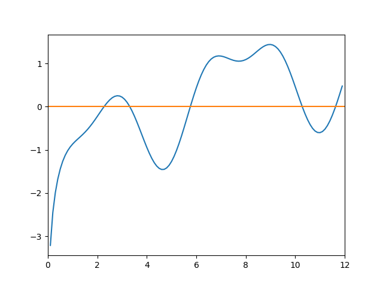

# Практическая работа №2

## Численные методы решения нелинейных уранвений.

</br></br></br></br>


Студент: Кайков Дмитрий Алексеевич  
Преподаватель: Лычёв Андрей Владимирович  
Группа: БИВТ-23-9 
Вариант: 7  
Подпись:
 

</br></br></br></br></br></br></br></br></br></br></br></br></br></br></br></br></br></br></br></br></br></br></br></br></br></br>


<center>Москва, 2024</center>

<div class="page"/>
<div style-"page-break-after: always;"></div>

**Цель работы:**  
Приобретение практических навыков для поиска решения нелинейных уравнений численными  методами.  
**Задача:**  
Требуется найти один из нулей функции *f(x)* на отрезке *[a, b]*, где функция
является непрерывной. То есть решить уравнение *f(x) = 0* и найти такую точку
*x<sup>∗</sup> ∈ [a, b], что f(x<sup>∗</sup>) = 0.*

**1 Аналитический вид функции**  
*f(x) = -2 + sin(x) + cos<sup>2</sup>(x) + log(|x|)*

**2 График функции**  
 

**3 Алгоритм**
X0 - начальное приблежение


**3 Листинг программы в виде текста**
```python
import matplotlib.pyplot as plt
import numpy as np 
import time


f = lambda x: -2 + np.sin(x) + np.cos(x)**2 + np.log(abs(x))
g = lambda x: np.e**(2 - np.sin(x) - np.cos(x)**2)


def method_simple_iteration(x0, f, g, is_show=False):
    a, b = 5, 7
    q = 5
    a -= q 
    b += q

    x = np.arange(a, b, 0.1)
    y = f(x)

    history = [x0]
    history_y = [f(x0)]
    colors = [1 / history_y[-1]]
    c_op = 0
    start_t = time.time()
    for i in range(47):
        xn1 = g(history[-1])
        history.append(xn1)
        history_y.append(f(history[-1]))
        colors.append(1 /history_y[-1])
        c_op += 6

    if is_show:
        plt.xlim(a, b)
        plt.ylim(-4, 4)
        plt.plot(x, y)
        plt.scatter(history, history_y, s=30, c=colors)
        plt.plot([a, b], [0, 0])
        plt.plot([history[-1], history[-1]], [-100, 100], c='red')
        plt.show()

    return history[-1], history_y[-1]


def method_secant(x0, f, g, is_show=False):
    a, b = 5, 7
    q = 5
    a -= q 
    b += q

    x = np.arange(a, b, 0.1)
    y = f(x)

    history = [x0, x0 - 1]
    history_y = [f(history[0]), f(history[-1])]
    colors = [1 / history_y[-2], 1 / history_y[-1]]
    c_op = 0
    start_t = time.time()
    for i in range(11):
        xn1 = history[-1] - (history[-1] - history[-2]) * f(history[-1]) / (f(history[-1]) - f(history[-2]))
        history.append(xn1)
        history_y.append(f(history[-1]))
        colors.append(1 /history_y[-1])
        c_op += 5

    if is_show:
        plt.xlim(a, b)
        plt.ylim(-4, 4)
        plt.plot(x, y)
        plt.scatter(history, history_y, s=30, c=colors)
        plt.plot([a, b], [0, 0])
        plt.plot([history[-1], history[-1]], [-100, 100], c='red')
        plt.show()

    return history[-1], history_y[-1]


def method_dichotomy(f, g, is_show=False):
    a, b = 5, 7
    q = 5
    a -= q 
    b += q
    a_border = a
    b_border = b
    print(a, b)

    x = np.arange(a, b, 0.1)
    y = f(x)

    history = []
    history_y = []
    colors = []
    c_op = 0
    start_t = time.time()
    for i in range(100):
        c = (a + b) / 2
        if f(b) * f(c) < 0:
            a = c
        else:
            b = c
        history.append(c)
        history_y.append(f(c))
        colors.append(1 /history_y[-1])
        c_op += 3

    if is_show:
        plt.xlim(a_border, b_border)
        plt.ylim(-4, 4)
        plt.plot(x, y)
        plt.scatter(history, history_y, s=30, c=colors)
        plt.plot([a_border, b_border], [0, 0])
        plt.plot([history[-1], history[-1]], [-100, 100], c='red')
        plt.show()

    return history[-1], history_y[-1]


x, y = method_simple_iteration(9, f, g, 1)
print(x, y)
```

**4 Результаты вычислений.**  
**Метод простых итераций**
| Число итераций | Количество вычислений функции | Найденное решение | Значение функции |
|--------------|-----------|------------|------------|
1 | 6 | 2.133413247232601 | -0.11189745888057911
2 | 12 | 2.3860054778830526 | 0.08513012228520156
3 | 18 | 2.191290187845913 | -0.0638490731791791
**4** | **24** | **2.335765256514423** | **0.0493198948082455**
5 | 30 | 2.223360245485684 | -0.03772797133397998
6 | 36 | 2.308845571311008 | 0.029251988295420528
7 | 42 | 2.242285500984663 | -0.02253451126017847
8 | 48 | 2.2933879305078424 | 0.017482989714037944
9 | 54 | 2.2536411119145527 | -0.01350786601775833
10 | 60 | 2.2842895254241253 | 0.010477942105968863
11 | 66 | 2.2604798281712233 | -0.008106608316144515
12 | 72 | 2.2788791299488707 | 0.006286269378274589
13 | 78 | 2.2645984150954956 | -0.004866897613764354
14 | 84 | 2.2756468477048157 | 0.0037730483880301646
15 | 90 | 2.267076899615506 | -0.0029221904799868748
16 | 96 | 2.2737114190926664 | 0.002265002476945943
17 | 102 | 2.268567285033972 | -0.00175457389159428
18 | 108 | 2.2725511479324956 | 0.0013598139928094888
19 | 114 | 2.26946300121058 | -0.0010534938028627927
20 | 120 | 2.271855126241388 | 0.0008164072744322182
21 | 126 | 2.270001124103262 | -0.0006325401799707198
22 | 132 | 2.271437445240361 | 0.000490165393603581
23 | 138 | 2.2703243380365707 | -0.0003797876458594418
24 | 144 | 2.2711867429272465 | 0.0002942950378744813
25 | 150 | 2.270518442282322 | -0.00022802957215006803
26 | 156 | 2.2710362466663865 | 0.00017669560481092805
27 | 162 | 2.27063499999354 | -0.00013691151214534347
28 | 168 | 2.2709458973471466 | 0.00010608891142671606
29 | 174 | 2.270704987948122 | -8.220302366523935e-05
30 | 180 | 2.2708916544361526 | 6.369642794112895e-05
31 | 186 | 2.2707470113561965 | -4.935543914630358e-05
32 | 192 | 2.270859087837901 | 3.8243766440015925e-05
33 | 198 | 2.2707722432939694 | -2.9633427365283183e-05
34 | 204 | 2.270839535055342 | 2.2961831726009407e-05
35 | 210 | 2.270787393018702 | -1.779215394615008e-05
36 | 216 | 2.2708277955770004 | 1.3786454049591335e-05
37 | 222 | 2.270796489129745 | -1.0682552546659174e-05
38 | 228 | 2.2708207471621313 | 8.277491243990909e-06
39 | 234 | 2.2708019505410744 | -6.413889413914298e-06
**40** | **240** | **2.2708165152603743** | **4.969869043192077e-06**
41 | 246 | 2.270805229627716 | -3.850949730321851e-06
42 | 252 | 2.2708139744013405 | 2.9839476375359553e-06
43 | 258 | 2.2708071984214557 | -2.3121403998072054e-06
44 | 264 | 2.270812448852589 | 1.7915852289496215e-06
45 | 270 | 2.2708083805021926 | -1.388227162113509e-06
46 | 276 | 2.2708115329022545 | 1.0756816549717385e-06
47 | 282 | 2.2708090902332603 | -8.335024148653503e-07

**Метод секущих**
| Число итераций | Количество вычислений функции | Найденное решение | Значение функции |
|--------------|-----------|------------|------------|
1 | 5 | 2.505132618170723 | 0.15943931519575072
2 | 10 | 2.295297983921315 | 0.01894640728379482
3 | 15 | 2.2670003815595865 | -0.0029821737124259284
4 | 20 | 2.2708487092695453 | 3.0132182968212184e-05
5 | 25 | 2.2708102143361937 | 4.50941277652106e-08
6 | 30 | 2.2708101566405006 | -6.882272529651345e-13
7 | 35 | 2.270810156641381 | 2.220446049250313e-16
8 | 40 | 2.2708101566413808 | -4.440892098500626e-16
9 | 45 | 2.270810156641381 | 2.220446049250313e-16
10 | 50 | 2.270810156641381 | 2.220446049250313e-16
11 | 55 | nan | nan

**Метод дихотомии**
| Число итераций | Количество вычислений функции | Найденное решение | Значение функции |
|--------------|-----------|------------|------------|
1 | 3 | 6.0 | 0.434270950395375
2 | 6 | 3.0 | 0.21981744005315984
3 | 9 | 1.5 | -0.5920361535880038
4 | 12 | 2.25 | -0.016394486611139958
5 | 15 | 2.625 | 0.2150439332745966
6 | 18 | 2.4375 | 0.11926310646577787
7 | 21 | 2.34375 | 0.055160390326461806
8 | 24 | 2.296875 | 0.02015275123639182
9 | 27 | 2.2734375 | 0.0020513798517612924
10 | 30 | 2.26171875 | -0.007131006930532591
11 | 33 | 2.267578125 | -0.0025293631120729687
12 | 36 | 2.2705078125 | -0.00023633973741243874
13 | 39 | 2.27197265625 | 0.000908187944514971
14 | 42 | 2.271240234375 | 0.000336090460969829
15 | 45 | 2.2708740234375 | 4.991687434408032e-05
16 | 48 | 2.27069091796875 | -9.320106299059994e-05
17 | 51 | 2.270782470703125 | -2.163950098776901e-05
18 | 54 | 2.2708282470703125 | 1.4139335161811317e-05
19 | 57 | 2.2708053588867188 | -3.749920810980356e-06
20 | 60 | 2.2708168029785156 | 5.194747703329838e-06
21 | 63 | 2.270811080932617 | 7.224235781810862e-07
22 | 66 | 2.270808219909668 | -1.5137460835923378e-06
23 | 69 | 2.2708096504211426 | -3.95660619600946e-07

**5 Вывод**

Метод простых итераций позволяет найти достаточно точное решение заданной функции за маленькое количество времени, и кол-во операций равному кол-ву операций вычисления функции. Но в сравнении с методом дихотомии и секущих сходимость метода хуже.